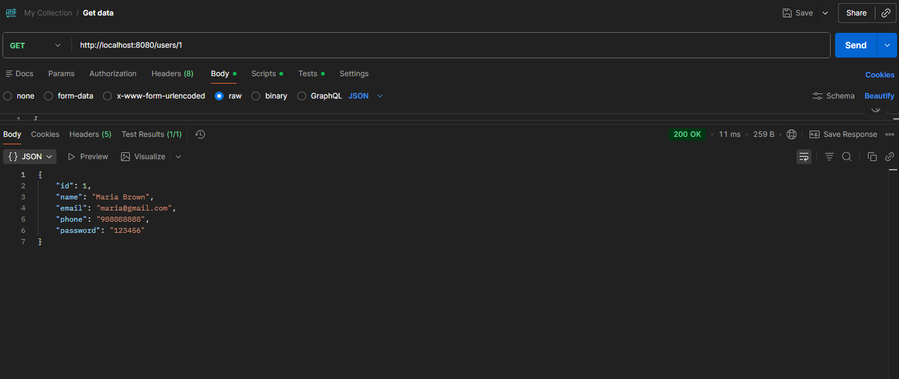
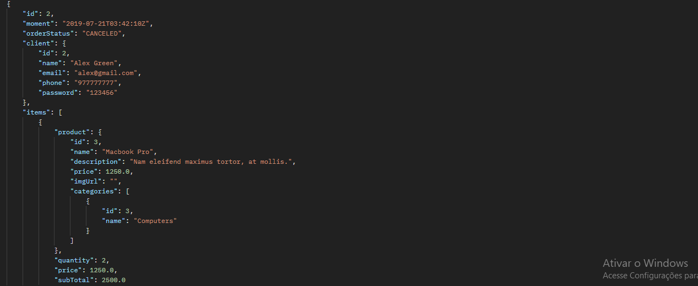
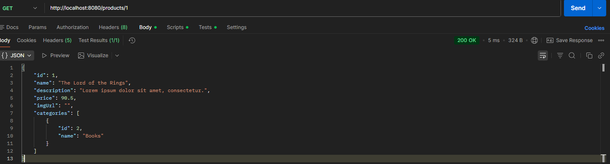
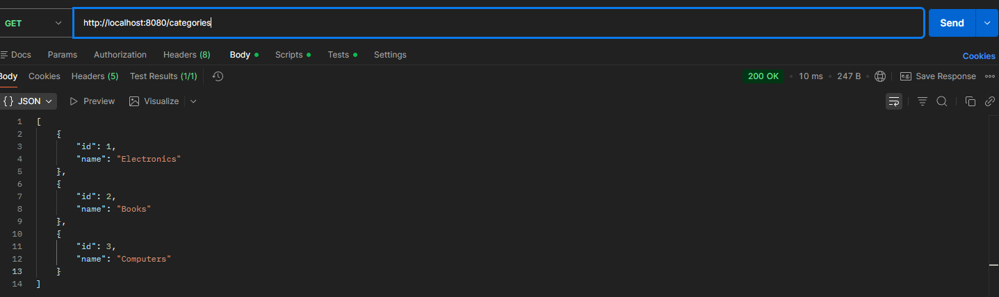

# 🛒 API REST - Sistema de Pedidos


API REST desenvolvida para estudo de **Java + Spring Boot**, simulando um sistema de **gerenciamento de pedidos**, contendo usuários, produtos, categorias e pagamentos.

O projeto utiliza **Spring Boot**, **JPA/Hibernate** e banco de dados **H2 em memória**.

---

# 🚀 Tecnologias Utilizadas

- Java 17
- Spring Boot
- Spring Data JPA
- Hibernate
- Maven
- Banco H2
- Postman

---

# 🏗 Arquitetura do Projeto

O projeto segue o padrão de **arquitetura em camadas**, separando responsabilidades dentro da aplicação.

## Estrutura do Projeto

```
src/main/java/com/educandoweb/course
│
├── config
│   └── TestConfig
│
├── entities
│   ├── User
│   ├── Order
│   ├── Product
│   ├── Category
│   ├── OrderItem
│   └── Payment
│
├── repositories
│
├── services
│
├── resources
│
└── resources
    └── exceptions
```


### Camadas

**Entities**

Representam as entidades do sistema e são mapeadas como tabelas no banco de dados utilizando **JPA**.

**Repositories**

Responsáveis pela comunicação com o banco de dados através do **Spring Data JPA**.

**Services**

Contêm as **regras de negócio da aplicação**.

**Resources (Controllers)**

Expõem os **endpoints REST** da aplicação.

**Exceptions**

Implementação de **tratamento global de erros** da API.

---

# 📊 Modelo de Domínio

O sistema foi modelado com as seguintes entidades:

- User
- Order
- Product
- Category
- OrderItem
- Payment

Relacionamentos utilizados:

- OneToMany
- ManyToOne
- ManyToMany
- OneToOne

---

# 💾 Banco de Dados

O projeto utiliza o banco **H2**, que roda em memória durante a execução da aplicação.

Isso permite executar a aplicação sem instalar um banco de dados externo.

### Console H2
http://localhost:8080/h2-console

Configuração padrão:
JDBC URL: jdbc:h2:mem:testdb
User: sa
Password:
---
# 🔗 Endpoints da API

### Usuários
GET /users
GET /users/{id}
---

### Pedidos
GET /orders
GET /orders/{id}

---
### Produtos
GET /products
GET /products/{id}

---
### Categorias


---

# 🧪 Testes da API (Postman)

Os testes da API foram realizados utilizando **Postman**.

### Buscar usuários



---

### Buscar pedidos



---

### Buscar produtos



---

### Buscar categorias


---

# 🧪 Dados de Teste

A classe **TestConfig** popula automaticamente o banco de dados com dados de exemplo ao iniciar a aplicação.

Isso permite testar os endpoints imediatamente após iniciar o projeto.

---

# 📚 Conceitos Praticados

Durante o desenvolvimento deste projeto foram praticados conceitos como:

- Desenvolvimento de **API REST**
- Arquitetura em camadas
- Persistência de dados com **JPA / Hibernate**
- Relacionamentos entre entidades
- Tratamento de exceções
- Injeção de dependência com Spring
- Gerenciamento de dependências com **Maven**

---

# 👨‍💻 Autor

**Vinicios Rosa Pereira**

FATEC — Desenvolvimento de Software Multiplataforma

📧 viniciosrp.dev@hotmail.com


